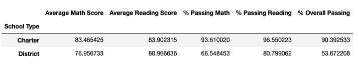
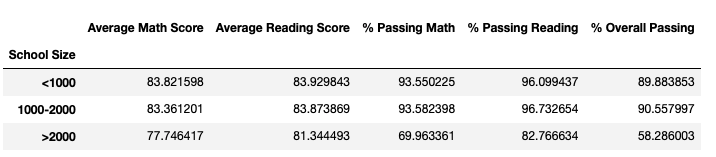
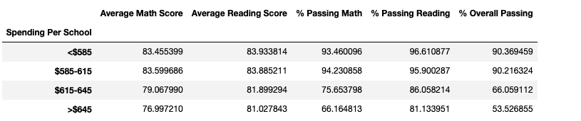

# School District Analysis

## Overview of District Audit
Snapshot of school district analysis based on Maria's submission of district audit results requirement. This report will help the school board make strategic decisions regarding future school budget and priorities.

### Purpose
The purpose of this analysis is to provide additional data to the school board to complete the audit. Especially, after evidence of academic dishonesty, regarding  reading and math grades for Thomas High School ninth graders. The data includes: 
- The school type
- The average math score
- The average reading score
- School size
- Spending Ranges (per student)
- Top performing Schhols
- Bottom Performing Schools

## School-Audit Results
### Analysis based on school type 
 

As per the analysis, Charter schools have the largest average score for math and reading.  

### Analysis based on school size
 

As per the analysis, the small and medium school size's performance is much better than the large school size. This data can help with future decisions by the board. 

### Analysis based on spending ranges (per student)
 

As per the analysis, it showed that more the spending range doesn't mean better results. It showed the opposite where schools with least spending performed the best!

## School-Audit Summary

This explains the summary of the school audit analysis. In this particular analysis, after removing the Thomas High School ninth graders data we focused on other schools to help school board look at different perspective. The overall passing rate between different school size, type, etc. It also shows performance of top and bottom performing schoools.

